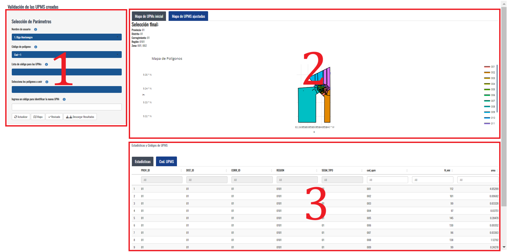
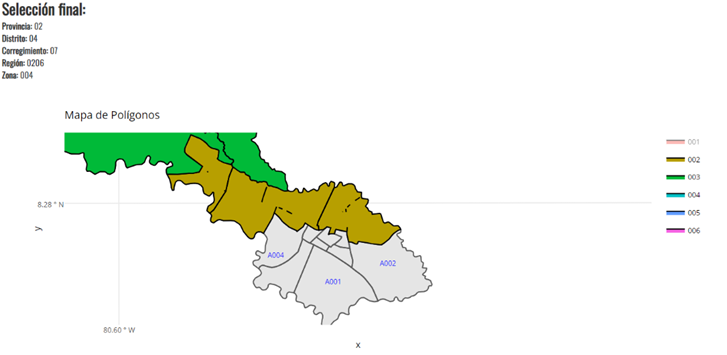
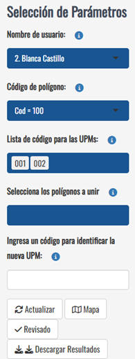
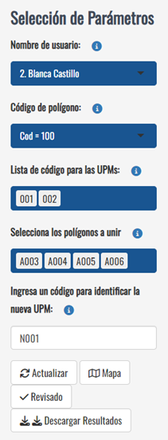
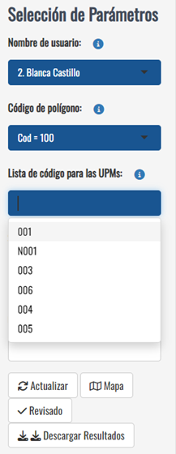
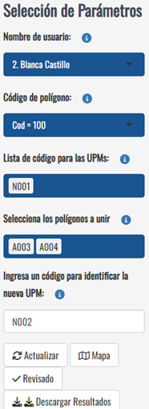
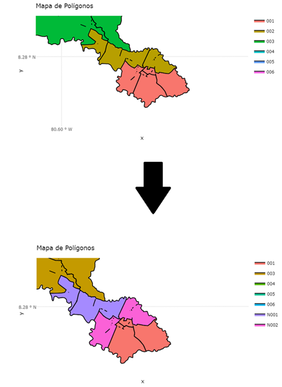

# Poner en marcha la aplicación

En el archivo server.R se debe crear primero los objetos "áreas_shape" y "shape_PAM" ejecutando los primeros bloques de código, esto cargará todos los shapefiles para así poder generar los mapas en la aplicación. Una vez que estos objetos estén en memoria, pueden comentarse estos bloques para que al correr la aplicación sea mucho más veloz. Finalmente, para poner en marcha la aplicación, se debe presionar el botón "Run App" en R, donde usualmente se encontraría el "Run".

## Partes de la Interfaz de la Aplicación

Una vez ejecutada la aplicación, se visualizarán tres bloques principales en la interfaz:

1.  **Bloque de Selección de Parámetros**: En este bloque se selecciona el usuario y el código del polígono a inspeccionar. Esta selección inicial permite a cada usuario validar las UPMs (Unidades Primarias de Muestreo) correspondientes a un polígono específico.

2.  **Bloque de Mapas**: Este bloque muestra el mapa del polígono seleccionado. Cada UPM dentro del polígono se representa con un color diferente para facilitar su identificación. Además, se incluyen herramientas para la interacción con el mapa, como:

    -   Descargar el mapa como imagen PNG.
    -   Zoom in y Zoom out.
    -   Desplazarse por el mapa.

    Al hacer clic sobre una UPM, esta se "desactiva" visualmente, permitiendo una inspección más detallada de los polígonos individuales que conforman cada UPM.

3.  **Bloque de Estadísticas y Códigos**: Aquí se presentan las estadísticas relevantes y los códigos de las UPMs dentro del polígono seleccionado. Esta información es crucial para validar las características de cada UPM y asegurarse de que cumplen con los requisitos mínimos, como el área y el número de viviendas.

Cada uno de estos bloques está diseñado para facilitar el proceso de validación de UPMs, guiando al usuario a través de la selección, inspección y ajuste de los polígonos en cada etapa del análisis.

{fig-align="center"}
## Proceso de Validación de UPMs

Cada usuario tiene asociado ciertos polígonos, estos polígonos de UPMs iniciales. En cada polígono se debe determinar si las UPMs iniciales son adecuadas (área del polígono, número de viviendas mínimas 120 y máximo 225, geografía) y dependiendo de si este es el caso o no, formar nuevas UPMs. 

### Selección de Polígono
Para comenzar se selecciona un usuario y un código de polígono a inspeccionar. Al seleccionar el polígono, el Bloque 2 (el mapa) se actualizará al polígono elegido, así como también la tabla del Bloque 3. Por ejemplo, aquí seleccionamos el usuario “Blanca Castillo” y el polígono de código 100.

{fig-align="center"}

### Inspección del Mapa 

Cada UPM en el mapa posee un color diferente para poder ubicarla, en la parte derecha se muestra el listado de colores y códigos. Al hacer clic en cualquiera de estos colores podemos “desactivar” una UPM en la visualización del mapa, esto permitirá observar los polígonos^[Estos polígonos no son los polígonos que uno selecciona al principio, estos son más pequeños y se encuentran dentro de las UPMs.]  que conforman esa UPM.

{fig-align="center"}

Además, el mapa cuenta con herramientas como: descargar el mapa como imagen PNG, Zoom in, Zoom out, desplazarse por el mapa, entre otras.

### Unión de polígonos
El procedimiento para crear nuevas Unidades Primarias de Muestreo (UPMs) consiste en unir un grupo de polígonos. Este proceso se lleva a cabo en cinco pasos esenciales:

1. **Identificación de Polígonos a Unir**: En el mapa, identifica los polígonos que deseas unir para formar la nueva UPM. Es importante que los polígonos sean contiguos y que el total de viviendas cumpla con el requisito mínimo y máximo establecido.

2. **Listar UPMs Existentes**: Localiza las UPMs actuales donde se encuentran estos polígonos y anótalas en el campo “Lista de código para las UPMs” en el Bloque de Selección de Parámetros (Bloque 1).

3. **Selección de Polígonos a Unir**: En el mismo bloque, en el campo “Selecciona los polígonos a unir,” lista los códigos de los polígonos que formarán la nueva UPM.

4. **Asignación de un Código de Identificación**: Elige y asigna un nuevo código para la UPM en el campo “Ingresa un código para identificar la nueva UPM” en el Bloque 1.

5. **Actualización y Visualización**: Para finalizar, presiona los botones “Actualizar” y “Mapa” para reflejar los cambios en las estadísticas y visualizar la nueva UPM en el mapa.

{fig-align="center"}

### Ejemplo

Inicialmente, la UPM 001 del polígono COD 100 está conformada por los polígonos A001, A002 y A004. Supongamos que se determina que el polígono A004 no puede estar en la misma UPM que los polígonos A001 y A002 (por ejemplo, porque la topografía lo impide). Entonces el polígono A004 debe pertenecer a otro grupo de polígonos que formen una UPM más adecuada.
Como los polígonos que conforman una UPM deben estar juntos entre sí, se debe buscar una UPM cercana al polígono A004, en este caso la UPM 002 es el único candidato para esto. De modo que se decide que se creará una nueva UPM con todos los polígonos que ya tiene la UPM 002, que son los A003, A005 y A006 junto con el polígono A004.

{fig-align="center"}
Así que, en el campo “Lista de código para las UPMs” del Bloque 1 se debe colocar las UPMs que tienen los polígonos que se pretenden unir, en este caso la UPM 001 y la UPM 002.

{fig-align="center"}

Luego en el campo “Selecciona los polígonos a unir”, se halla una lista con todos los polígonos dentro de las UPM 001 y 002. 

{fig-align="center"}

En este campo se selecciona qué polígonos se pretende unir para crear la nueva UPM y luego en el campo de abajo, su código de identificación. Siguiendo el ejemplo, para crear una nueva UPM con código N001, que sea la combinación entre todos los polígonos que forman la UPM 002 y el polígono A004 el bloque Selección de parámetros tendría esta forma:

{fig-align="center"}

Al presionar el botón “Actualizar” se creará la nueva UPM. 

###  Visualizar Cambios
Para apreciar los datos de esta modificación se debe hacer clic en la pestaña “Mapa de UPMS ajustadas” del Bloque 2. Cómo se puede ver, la tabla del Bloque 3 ha cambiado, el registro asociado a la UPM 002 desapareció, y además existe un nuevo registro correspondiente a la nueva UPM N001.

{fig-align="center"}

Es importante notar, que las columnas de conteo de viviendas y de área se han actualizado de acuerdo con la creación de la nueva UPM, esto permite el seguimiento de estos parámetros y es fundamental tener un control presente al realizar estas modificaciones a las UPMs.

Además, si se presiona el botón “Mapa” del Bloque 1, la visualización del mapa se actualizará tomará en cuenta dicha modificación.

{fig-align="center"}

## Modificaciones
Anteriormente se vio cómo unir un grupo de polígonos para crear una nueva UPM. Ahora bien, la creación de esta nueva UPM pudo haber generado otros problemas relacionados al conteo de viviendas o del área, quizás ahora hay una UPM muy pequeña (quizás la UPM 001 ahora cuenta con muy pocas viviendas) o bien, la UPM nueva tiene demasiadas viviendas. Por esta razón es importante mantener el control de estos parámetros y realizar cambios si es que fuera necesario. Sin embargo, solucionar estos problemas consiste esencialmente crear nuevas UPMs: si hay UPM muy pequeñas hay que unir sus polígonos con polígonos de otras UPM más grandes, si una UPM es muy grande hay que formar dos UPM a partir de esta.

## Separar UPMs

Al momento de crear una nueva UPM se unen ciertos polígonos de otras UPMs, esas UPMs de las cuales se toman los polígonos se modifican porque claro, ya no tendrán esos polígonos. Ahora bien, si los polígonos que se toman para crear una nueva UPM están todos dentro de una UPM, el resultado será la nueva UPM y además la UPM de donde se tomaron los polígonos.
Tomemos el ejemplo concreto donde separaremos la UPM N001 creada anteriormente.  Supongamos que se quiere tener dos UPM: una formada por A003 y A004 y otra formada por A005 y A006, bastaría con crear una nueva UPM que tenga los polígonos A003 y A004. Primero seleccionamos la UPM N001

{fig-align="center"}

Luego, dentro de estas seleccionamos los polígonos A003 y A004, y nombramos a la nueva UPM como N002.

{fig-align="center"}

Esto resulta en los siguientes cambios
{fig-align="center"}

Como podemos apreciar, la UPM N001 se ha separado en dos: la UPM N002 que tiene los polígonos A003 y A004 y la UPM N001, que ha sido modificada y que ahora tiene los polígonos A005 y A006.

## Descarga de Actualizaciones

Una vez realizados todos los cambios deseados dentro de un polígono se procede a hacer clic en el botón “Revisado” del Bloque 1. Esto permitirá crear un registro de cambios que luego pueden ser descargados usando el botón “Descargar resultados” en formato .rds.

 

